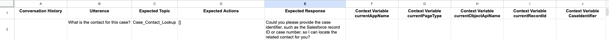

# Testing Center - Configuration Guide <!-- omit from toc -->


This guide will help you configure the Agentforce Testing Center to test your agents and gain confidence for your deployments.

# Document History <!-- omit from toc -->

| Attribute  | Value                                            |
| ---------- | ------------------------------------------------ |
| Author     | Andres Perez (ELTOROit)                          |
| Repo       | https://github.com/eltoroit/Testing-Center-Notes |
| 2025-09-14 | Added warning on **Evaluations**                 |
| 2025-09-10 | Published repo                                   |
| 2025-09-09 | Document created                                 |

# Table of Contents <!-- omit from toc -->

- [Simple Demo Agent](#simple-demo-agent)
	- [Topic: Case Contact Lookup](#topic-case-contact-lookup)
	- [Topic: Order Pizza](#topic-order-pizza)
- [Use The Agent](#use-the-agent)
	- [Scenario #1: Not in a case record](#scenario-1-not-in-a-case-record)
	- [Scenario #2: On the case object (list view)](#scenario-2-on-the-case-object-list-view)
	- [Scenario #3: In a case record](#scenario-3-in-a-case-record)
- [Testing In Agentforce Builder](#testing-in-agentforce-builder)
	- [Scenario 1: Edit the utterance](#scenario-1-edit-the-utterance)
	- [Scenario 2: Simulate record page](#scenario-2-simulate-record-page)
	- [Scenario #3: Using context variables](#scenario-3-using-context-variables)
- [Testing Center (Declarative)](#testing-center-declarative)
	- [Creating a test](#creating-a-test)
	- [CSV File](#csv-file)
		- [Row #1](#row-1)
		- [Row #2](#row-2)
		- [Row #3](#row-3)
		- [Row #4](#row-4)
		- [Row #5](#row-5)
		- [Row #6](#row-6)
	- [Test Results](#test-results)
		- [Columns A - J](#columns-a---j)
		- [Columns K - O](#columns-k---o)
		- [Columns P - T](#columns-p---t)
		- [Columns U - Z](#columns-u---z)
		- [Columns AA - AF](#columns-aa---af)
		- [Columns AG - AJ](#columns-ag---aj)
	- [Why did we get only 83%?](#why-did-we-get-only-83)
- [Additional Information](#additional-information)

# Simple Demo Agent

Before we can talk about testing agents, we need to build a simple "Hello World" agent that we can test. I have built such an agent that we can test, but before we get there, let's examine the agent I built.

In this particular document, we will test an "_Agentforce (Default)_" agent, but the guide could be used to test any other type of agents: ASA (Service agents deployed via MIAW), AEA (Agentforce Employee Agents), etc.


The agent I built is a very simple one, with two basic topics to understand how the testing works.

-   Case Contact Lookup
-   Order Pizza


## Topic: Case Contact Lookup


The first topic will help us find the contact that is associated with the current case. The topic has three standard actions associated with it.


## Topic: Order Pizza

This is a simple test topic that will help us set the value for a Context Variable. You may be thinking why we want to create this topic, and that's a great question. The reason is, I just want to have a custom action that sets the case identifier, so that we can test that.

Let's analyze the topic configuration.


There is a single custom action associated with this topic


But this topic is important, so let's take a look at it.


Let's talk about the flow


The flow is a very simple, minimal flow. We can see we have an input variable named `strinQuestion` which is very much ignored by the flow (Agentforce requires actions to have at least one input), and we have one output variable named `stroutCaseId` which as you can see is returning a hard-coded case number **00001027**.

Let's finish talking about the action and it will make a bit more sense...


As you can see, we are just passing whatever utterance the user types, and we are ignoring it in the flow... So it's irrelevant, but remember we are returning the case number **00001027**, and we'll store that in the context variable named `CaseIdentifier`.

# Use The Agent

Well, now that we have the agent built and active, let's take it for a spin.

## Scenario #1: Not in a case record

If we go to the Salesforce frontend and run the agent, but we are not in a case record page, the utterance `What is the contact for this case?` is not going to work as expected, because it does not know which case the user is referring to.


## Scenario #2: On the case object (list view)

Even if we are in the Cases tab, on the list view... it does not know which case it would refer to.


## Scenario #3: In a case record

But if we go to the actual case record, it will be able to know we are talking about the actual record, because the recordId is in the URL, and therefore, it will give us the answer we are looking for.


# Testing In Agentforce Builder

Although I started testing the agent backwards on the front-end, we really do a lot of testing in the **Agentforce Builder** before we actually test in the front-end. I tested it backwards because it was easier to understand some concepts. But let's take a look to see how we can test it in the **Agentforce Builder**.


Similarly to what happened earlier, since we do not have a specific case record, the agent will not be able to provide the answer to us but rather ask us to provide the case.

There are several options to do this:

## Scenario 1: Edit the utterance

This is probably the easiest thing to do, but not necessarily the best because it's going to test an utterance different from the one the users will execute on the front-end when located on the case record.


As you can see, here we run the utterance with slight variations and we get the expected results... but we had to make changes to the utterance which is not really testing the same utterances the user would type.

## Scenario 2: Simulate record page

Let's simulate the agent is running in the record page, so that we do not need to modify the utterance and type the case number (name) or the case record ID.

In the third column (Conversation Preview), there is a button


When we click on that, we get a form that allows us to define the page we want to use for testing


Once we have the page set, we can run the utterances as if the user was using the agent in that page.


## Scenario #3: Using context variables

Do you remember that topic we mentioned at the beginning but that we have not used yet: `Order Pizza`? Well, it's time to talk about it. In our agent it's a very simple action, but imagine it's a bit more complex and some actions are setting custom context variables that we use in subsequent actions. You can test them in the **Agentforce Builder** very easily. We just need to invoke the different actions like this:


# Testing Center (Declarative)

Now that we have a good understanding of how agents work, and how they can be tested in the **Agentforce Builder**, it's time to take our tests to the next level.

## Creating a test

Once you go to the Agentforce Testing Center, and click on the **New** button, you will get to the first page of the wizard named **Basic Information**.


Here you want to give the test a name, and select the agent (and version) you are testing.

Clicking **Next** takes you to the second page of the wizard named **Test Conditions**.


This part is important if you want to generate a template on the next page (Test Data), but it does not control the actual test execution. So, even though we will use the conversation history and context variables, I am not selecting the checkboxes because I am not generating a template. I will use a CSV file that I already have created.

Once you click **Next**, we get to the third page named **Test Data**.


If you already have a CSV file, then you can just upload that. If you do not have a CSV file, then you can have AI generate one for you, or you can download the template and make changes, then export it as a CSV file and upload it.

Once you click **Next**, we get to the fourth page named **Evaluations**.

**⚠️ WARNING:** As of 2025-09-14, there is an issue where selecting any Evaluations crashes the testing center. For now, Do not select them.


This page allows you to specify what type of tests you want to execute. There are some tests that are always going to be executed, and some tests that are optional. You indicate here which optional tests (if any, or all) you want to execute.

| Required | Name                | Description                                                                   |
| -------- | ------------------- | ----------------------------------------------------------------------------- |
| ✅       | Topic Assertion     | Was the **expected topic** selected?                                          |
| ✅       | Action Assertion    | Were the **expected actions** selected? (there could be more than one action) |
| ✅       | Response Evaluation | Did the response match the **expected response**                              |
|          | Completeness        | Does the response include all necessary information?                          |
|          | Coherence           | Is the response easy to read and free of grammatical errors?                  |
|          | Conciseness         | Is the response short but accurate?                                           |
|          | Latency             | How long (milliseconds) does the agent take to generate a response?           |

At the end of the wizard, click **Save & Run** to start the test.


## CSV File

While the test is being executed, let's talk about the CSV file that contains the test definitions.


As you can see, I am using Google Sheets to create a tab that contains the tests that I will run. Once I modified the tests and adjusted the tests, I export that sheet as CSV and upload it in the wizard we discussed previously.

Before we talk about each of the rows, let's try to agree on how to read this section. As you can imagine, the image will not be very readable for each of the rows.



We will need to do a simple trick, flipping the table 90 degrees. PLEASE NOTE, this is only for the explanation; you must keep the rows as rows in the CSV file. So for example, the first row will look like this

| Column | Title                                 | Value                                                                                                                                       |
| ------ | ------------------------------------- | ------------------------------------------------------------------------------------------------------------------------------------------- |
| A      | Conversation History                  |                                                                                                                                             |
| B      | Utterance                             | What is the contact for this case?                                                                                                          |
| C      | Expected Topic                        | Case_Contact_Lookup                                                                                                                         |
| D      | Expected Actions                      | []                                                                                                                                          |
| E      | Expected Response                     | Could you please provide the case identifier, such as the Salesforce record ID or case number, so I can locate the related contact for you? |
| F      | Context Variable currentAppName       |                                                                                                                                             |
| G      | Context Variable currentPageType      |                                                                                                                                             |
| H      | Context Variable currentObjectApiName |                                                                                                                                             |
| I      | Context Variable currentRecordId      |                                                                                                                                             |
| J      | Context Variable CaseIdentifier       |                                                                                                                                             |

Does that make sense?

### Row #1

Let's look at the first row

| Column | Title                                 | Value                                                                                                                                       |
| ------ | ------------------------------------- | ------------------------------------------------------------------------------------------------------------------------------------------- |
| A      | Conversation History                  |                                                                                                                                             |
| B      | Utterance                             | What is the contact for this case?                                                                                                          |
| C      | Expected Topic                        | Case_Contact_Lookup                                                                                                                         |
| D      | Expected Actions                      | []                                                                                                                                          |
| E      | Expected Response                     | Could you please provide the case identifier, such as the Salesforce record ID or case number, so I can locate the related contact for you? |
| F      | Context Variable currentAppName       |                                                                                                                                             |
| G      | Context Variable currentPageType      |                                                                                                                                             |
| H      | Context Variable currentObjectApiName |                                                                                                                                             |
| I      | Context Variable currentRecordId      |                                                                                                                                             |
| J      | Context Variable CaseIdentifier       |                                                                                                                                             |

The test case is similar to what we had in the **Agentforce Builder** where it did not find a related case record, and for this reason, the expected response is asking to provide a case identifier.

I am expecting Agentforce to find a topic `Case_Contact_Lookup` rather than the pizza one, because the utterance is asking for information related to the case.

Notice also that I am not expecting any actions (flows, Apex, prompt templates, etc.) to be executed, and therefore it's an empty list of actions. Agentforce should ask for more information before an action is executed.

### Row #2

| Column | Title                                 | Value                                                                                                                                        |
| ------ | ------------------------------------- | -------------------------------------------------------------------------------------------------------------------------------------------- |
| A      | Conversation History                  | [{"role": "user", "message": "Get ready for some questions on case 500gL00000IQogOQAT. Ready?"}, {"role": "agent", "message": "I am ready"}] |
| B      | Utterance                             | What is the contact for this case?                                                                                                           |
| C      | Expected Topic                        | Case_Contact_Lookup                                                                                                                          |
| D      | Expected Actions                      | ['GetRecordDetails']                                                                                                                         |
| E      | Expected Response                     | The contact for case number 00001027 is Andres (ELTOROit) Perez                                                                              |
| F      | Context Variable currentAppName       |                                                                                                                                              |
| G      | Context Variable currentPageType      |                                                                                                                                              |
| H      | Context Variable currentObjectApiName |                                                                                                                                              |
| I      | Context Variable currentRecordId      |                                                                                                                                              |
| J      | Context Variable CaseIdentifier       |                                                                                                                                              |

This test case simulates that we are already having a conversation with the agent. The agent has already determined that we are going to be talking about a specific case record ID (`500gL00000IQogOQAT`). So let's suppose a user has been interacting with the agent in previous utterances and it has been determined that the user is working with the particular case that is mentioned. Basically, we are adding this to the "conversation context" for the LLM.

This conversation is probably easier to understand if we format it using multiple lines. As you can see, it's just an array where each element of the array is a message and who posted it.

```json
[
	{
		"role": "user",
		"message": "Get ready for some questions on case 500gL00000IQogOQAT. Ready?"
	},
	{
		"role": "agent",
		"message": "I am ready"
	}
]
```

Or even better, in a graphical way


Once we set the conversation, then we can use the utterance without explicitly indicating a case number or a case ID (`What is the contact for this case?`).

With the utterance and the conversation context, we can expect the topic to be found is the one for the case (`Case_Contact_Lookup`) rather than the pizza one, and that it's going to call one single action (`GetRecordDetails`). Notice we have a list, but now it has one single action. Finally, the expected result is that it knows who the contact is (`Andres (ELTOROit) Perez`).

### Row #3

| Column | Title                                 | Value                                                                                                                                          |
| ------ | ------------------------------------- | ---------------------------------------------------------------------------------------------------------------------------------------------- |
| A      | Conversation History                  | [{"role": "user", "message": "Get ready for some questions with the case named 00001027. Ready?"}, {"role": "agent", "message": "I am ready"}] |
| B      | Utterance                             | What is the contact for this case?                                                                                                             |
| C      | Expected Topic                        | Case_Contact_Lookup                                                                                                                            |
| D      | Expected Actions                      | ['IdentifyRecordByName', 'GetRecordDetails']                                                                                                   |
| E      | Expected Response                     | The contact for case number 00001027 is Andres (ELTOROit) Perez                                                                                |
| F      | Context Variable currentAppName       |                                                                                                                                                |
| G      | Context Variable currentPageType      |                                                                                                                                                |
| H      | Context Variable currentObjectApiName |                                                                                                                                                |
| I      | Context Variable currentRecordId      |                                                                                                                                                |
| J      | Context Variable CaseIdentifier       |                                                                                                                                                |

This test case is similar to the previous one. The only difference is that during the conversation with the agent we have not provided a case record ID, but rather a case record number (record name) with a value of `00001027`.

In here there are two actions that the agent needs to perform. It first needs to find the case record ID using the action named `IdentifyRecordByName`, and then get the details for that record `GetRecordDetails`.

### Row #4

| Column | Title                                 | Value                                                           |
| ------ | ------------------------------------- | --------------------------------------------------------------- |
| A      | Conversation History                  |                                                                 |
| B      | Utterance                             | What is the contact for this case?                              |
| C      | Expected Topic                        | Case_Contact_Lookup                                             |
| D      | Expected Actions                      | ['GetRecordDetails']                                            |
| E      | Expected Response                     | The contact for case number 00001027 is Andres (ELTOROit) Perez |
| F      | Context Variable currentAppName       | Service                                                         |
| G      | Context Variable currentPageType      | Record Page                                                     |
| H      | Context Variable currentObjectApiName | Case                                                            |
| I      | Context Variable currentRecordId      | 500gL00000IQogOQAT                                              |
| J      | Context Variable CaseIdentifier       |                                                                 |

This test case does not have an ongoing conversation, but we are assuming the user is asking this question in the case record page in the frontend. We are indicating the App (`Service`), which page (`Record Page`), which SObject (`Case`), and the case record ID (`500gL00000IQogOQAT`).

Since we have the case record ID, this works very similar to row #2.

### Row #5

| Column | Title                                 | Value                                                           |
| ------ | ------------------------------------- | --------------------------------------------------------------- |
| A      | Conversation History                  |                                                                 |
| B      | Utterance                             | What is the contact for this case?                              |
| C      | Expected Topic                        | Case_Contact_Lookup                                             |
| D      | Expected Actions                      | ['GetRecordDetails']                                            |
| E      | Expected Response                     | The contact for case number 00001027 is Andres (ELTOROit) Perez |
| F      | Context Variable currentAppName       |                                                                 |
| G      | Context Variable currentPageType      |                                                                 |
| H      | Context Variable currentObjectApiName |                                                                 |
| I      | Context Variable currentRecordId      |                                                                 |
| J      | Context Variable CaseIdentifier       | 500gL00000IQogOQAT                                              |

This test case does not assume that we are in the case record page, but it assumes another action has already set the `CaseIdentifier` custom context variable to the case record ID (`500gL00000IQogOQAT`). It's kind of similar to rows #2 and #3 where we are assuming some utterances have already been exchanged in the conversation and that the results of the actions have set some of the context variables. Do you remember the pizza example? Where the output was assigned to a custom context variable? Well, we are testing that!

Since we have the case record ID, this works very similar to row #2.

### Row #6

| Column | Title                                 | Value                                                           |
| ------ | ------------------------------------- | --------------------------------------------------------------- |
| A      | Conversation History                  |                                                                 |
| B      | Utterance                             | What is the contact for this case?                              |
| C      | Expected Topic                        | Case_Contact_Lookup                                             |
| D      | Expected Actions                      | ['QueryRecords', 'GetRecordDetails']                            |
| E      | Expected Response                     | The contact for case number 00001027 is Andres (ELTOROit) Perez |
| F      | Context Variable currentAppName       |                                                                 |
| G      | Context Variable currentPageType      |                                                                 |
| H      | Context Variable currentObjectApiName |                                                                 |
| I      | Context Variable currentRecordId      |                                                                 |
| J      | Context Variable CaseIdentifier       | 00001027                                                        |

The last test case is very similar to the previous one, where a previous action sets a context variable, but in this case it's setting it to the case name (case number) rather than the case ID, so we need to get the ID (`QueryRecords`) and then query the record (`GetRecordDetails`).

## Test Results

So once we have configured this, and executed the tests, we can see the results


We can see here that 100% of the topics and responses passed, but only 83% of the actions did.

This brings me to a good point to be aware of. Because the LLM is non-deterministic, we should not expect to have 100% pass rates every single time, and also, it's possible that if I run the tests again, then I will get 100% for all three values. Nonetheless, it's important to understand why we did not get 100% for the actions, and decide on which of the three options to choose for each row:

-   Fix the agent
-   Fix the test
-   Don't change, it's a non-deterministic variation

But before we do the analysis on this particular test results, let's understand the results we obtained. This screen is not as easy to see and work with as a CSV loaded on Google Sheets. We can download the results using the **Download Results** in the top right corner and load the CSV into Google Sheets.

Let's take a look at the downloaded file in Google Sheets, analyzing a few columns at a time.

### Columns A - J


| Column | CSV | Note                                                                                                      |
| ------ | --- | --------------------------------------------------------------------------------------------------------- |
| A      |     | Test case row number (as covered above). Not really part of the output but put it here for easy reference |
| B      | ✅  | User's utterance, notice it's all the same utterance but with different configuration as noted above      |
| C      |     | Each test is a unique independent session. This could potentially be tracked, I have not tested.          |
| D      |     | All the tests completed                                                                                   |
| E      |     | Explanation for the failed status                                                                         |
| F      | ✅  | Expected topic                                                                                            |
| G      | ✅  | Actual topic                                                                                              |
| H      |     | Did the expected topic match the actual topic?                                                            |
| I      |     | Topic numeric score                                                                                       |
| J      |     | Explanation for the topic mismatch                                                                        |

### Columns K - O


| Column | CSV | Note                                                                                                     |
| ------ | --- | -------------------------------------------------------------------------------------------------------- |
| K      | ✅  | Expected Action                                                                                          |
| L      | ✅  | Actual Action                                                                                            |
| M      |     | Did the expected action match the actual action?                                                         |
| N      |     | Action numeric score                                                                                     |
| O      |     | Explains why the action did not match the expectations, but in this case it's clear. Nothing to explain. |

### Columns P - T


| Column | CSV | Note                                                                        |
| ------ | --- | --------------------------------------------------------------------------- |
| P      | ✅  | Expected Response                                                           |
| Q      | ✅  | Actual Response                                                             |
| R      |     | Did the expected and actual responses match?                                |
| S      |     | Numeric score for the response matching                                     |
| T      |     | Explanation of the differences between the expected and the actual response |

Note that in column `R`, it's not looking for a 100% text match (character by character, but general idea). If you look closely at row #1 for example, the actual outcome has a case number in parentheses, but that is not in the expected response, and it still matched successfully. Another example is in row #2 where the case number is in the expected, but not in the actual response, and again it still matched the responses.

Notice that in column `S`, the scores have slight differences.

### Columns U - Z


| Column | CSV | Note                                            | Sample Value       |
| ------ | --- | ----------------------------------------------- | ------------------ |
| U      | ✅  | Conversation History                            |                    |
| V      | ✅  | Standard Context Variable: currentObjectApiName | Case               |
| W      | ✅  | Standard Context Variable: currentAppName       | Service            |
| X      | ✅  | Custom Context Variable: CaseIdentifier         | 500gL00000IQogOQAT |
| Y      | ✅  | Standard Context Variable: currentRecordId      | 500gL00000IQogOQAT |
| Z      | ✅  | Standard Context Variable: currentPageType      | Record Page        |

All these values are loaded from the input CSV file.

### Columns AA - AF


| Column | CSV | Note                             |
| ------ | --- | -------------------------------- |
| AA     |     | Completeness status (pass, fail) |
| AB     |     | Completeness numeric score       |
| AC     |     | Completeness explanation         |
| AD     |     | Coherence status (pass, fail)    |
| AE     |     | Coherence numeric score          |
| AF     |     | Coherence explanation            |

Remember that **completeness** determines if the response includes all necessary information. You can see in test case row #1, the response obtained is asking for additional information to identify the case, but the user's utterance was `What is the contact for this case?`. So the answer is not complete because it does not provide the contact for the case.

On the other hand, **Coherence** determines if the response is easy to read and free of grammatical errors. I am not exactly sure when this fails, since the language is typically created by Agentforce. It would be interesting to run some tests on what happens when the answer is generated by a Flow or Apex and output verbatim, and the answer is not clear and/or it's difficult to read. Another option would be if we return JSON strings, rather than natural language.

### Columns AG - AJ


| Column | CSV | Note                            |
| ------ | --- | ------------------------------- |
| AG     |     | Conciseness status (pass, fail) |
| AH     |     | Conciseness numeric score       |
| AI     |     | Conciseness explanation         |
| AJ     |     | Latency                         |

Remember that **Conciseness** determines if the response is short but accurate. Similarly to the previous columns, this answer is most likely generated by the LLM with few exceptions, so it would be difficult (but not impossible) to fail. Having said that, note that test case rows #3 and #6 do fail, because the answer takes 2 lines of text to respond where similar responses (test case rows #2, #4, and #5) just have one word on the second line.

Remember that **Latency** determines how long, in milliseconds, it takes the agent to generate a response.

## Why did we get only 83%?

If you go back to the results of the test, you may remember we got only 83% for the actions


But why? Well, good question. There is only one test case (row #3) that failed. Let's look at the results for that particular row, but only including the relevant columns.


I think in this case, the problem was in my expectations. I was expecting that Agentforce would use the action named `IdentifyRecordByName` to get the case ID when I requested to get the contact related to the case. Going back to the **Agentforce Builder** and running this same test case, I can see what's going on.

Let’s analyze the important parts from the planner to see what’s going on.


_Note: I modified the planner manually by removing unnecessary sections before taking this picture._

Here we see that when I was loading the conversation, with the utterance `Get ready for some questions with the case named 00001027. Ready?` Agentforce found the case before ID using the action `NameIdentifyRecordByName`, so then when the test utterance was executed `What is the contact for this case?` it does not need to run that action again.

If I modified my test to reflect that, and run the test again, we should now get 100%.


Hopefully this has been a very helpful walkthrough of the Agentforce Testing Center.

# Additional Information

-   Salesforce official documentation:
    -   [Agentforce Testing Center](https://help.salesforce.com/s/articleView?id=ai.agent_testing_center.htm&type=5)
-   Philippe Ozil (Salesforce Developer Advocate) published a good video named "Agentforce NOW codeLive: Test Agents with Agentforce Testing Center". You can watch it either in [LinkedIn](https://www.linkedin.com/events/7352044882699472896/) or in [YouTube](https://youtu.be/QaDRfagYSDk?t=887).
-   Blog Post "[Ensuring AI Accuracy: 5 Steps To Test Agentforce](https://admin.salesforce.com/blog/2025/ensuring-ai-accuracy-5-steps-to-test-agentforce)"
